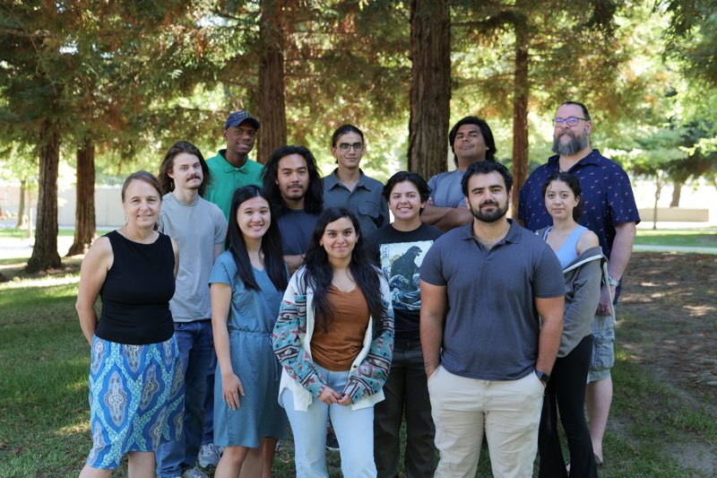

Workshop outcomes
1. 27 interviews, 10 guest speakers, and 2 field trips
1. A problem bank with 150 challenges related to bottlenecks in four “buckets” 
1. 70 of those challenges were developed into a brief description of the problem, illustrated by
photographs, and complete with resources and the beginning of an ecosystem
1. A letter to the MJC president
1. A presentation and slide set about what we did and learned
1. A documentary video

The workshop grew out of MJC’s engagement in the Stanislaus2030 initiative which identified strategies for strengthening our regional economy including growing local bioindustrial manufacturing activities. MJC is now a collaborator in the BioEconomy, Agriculture, and Manufacturing (BEAM) Initiative catalyzed by this planning effort and is working with others across the region to advance innovations that transform biomass into valuable and sustainable products.
